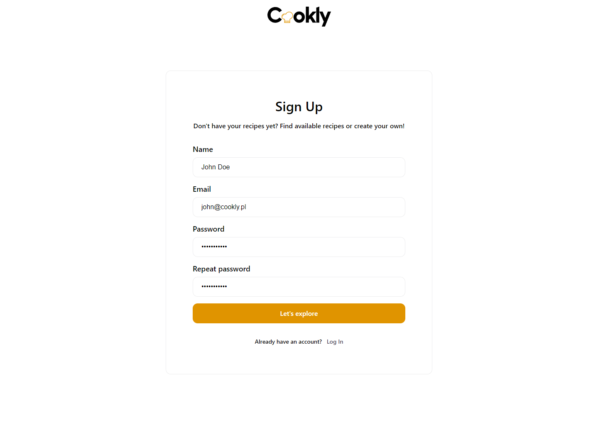
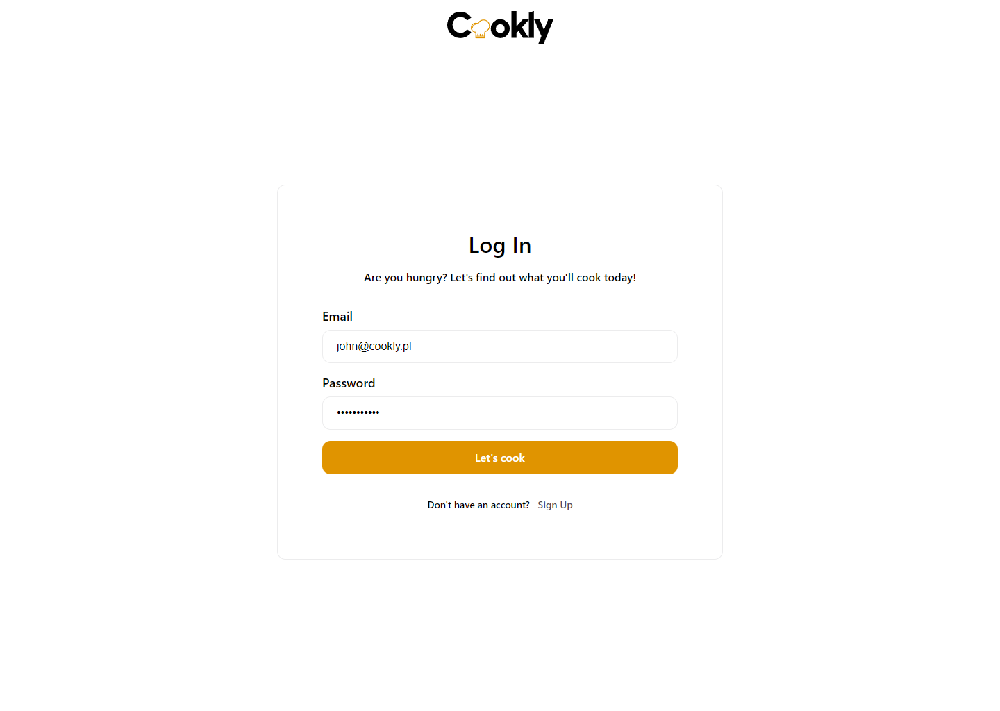
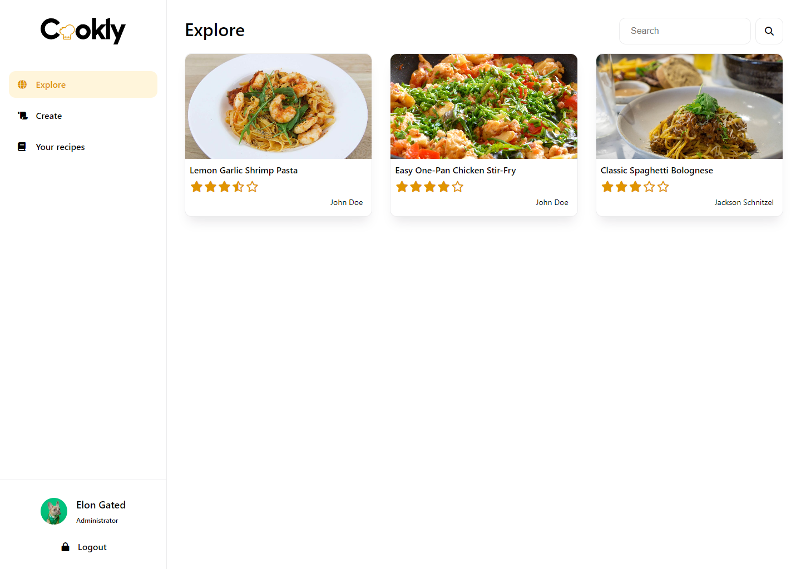
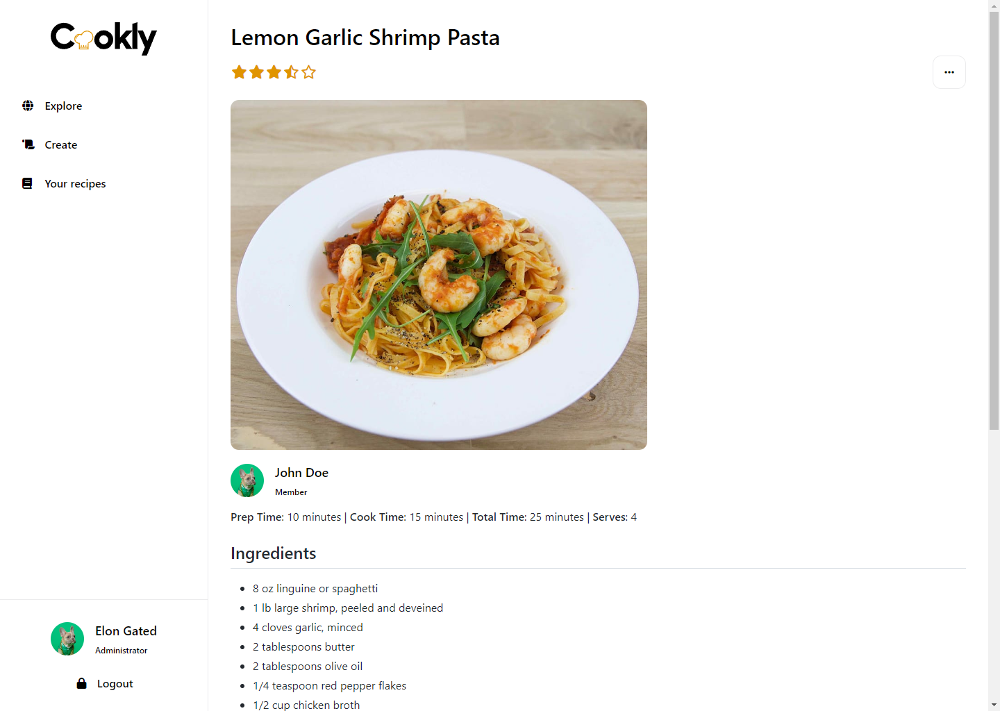
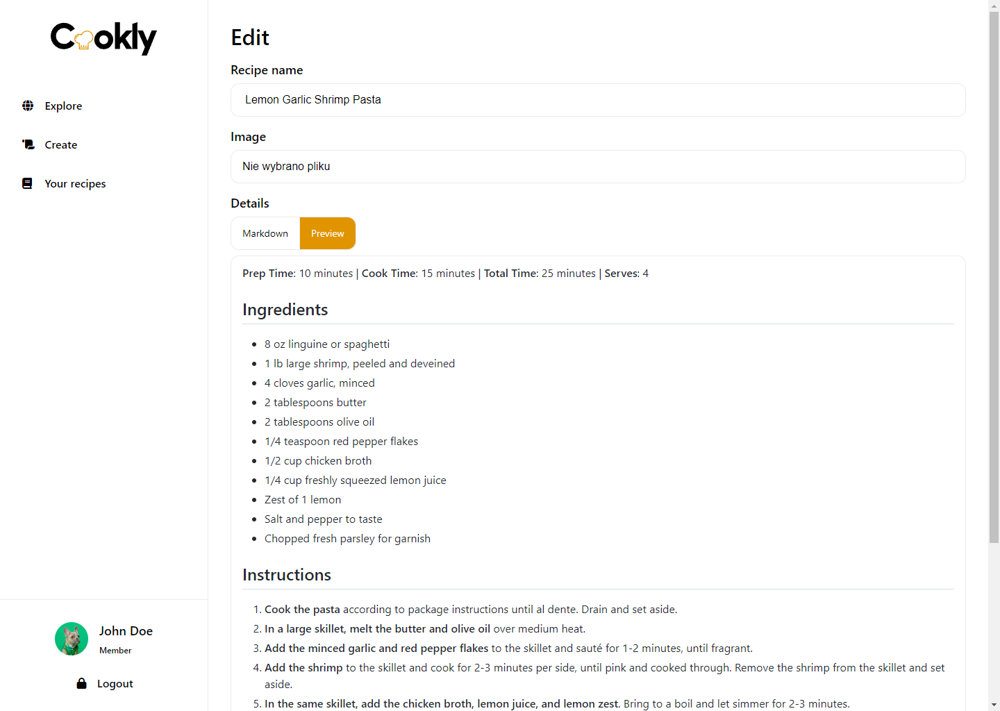

# Cookly

A web application for sharing and discovering culinary recipes.

## About

This repository was created as a project for a university course. The purpose of this project is to demonstrate the
skills and knowledge acquired during the course.

## Getting started

In order to start development, Docker and Docker Compose is needed. Running development environment can be done using
the following command

```sh
docker compose up -d
```

Project uses Composer to enable namespaces in PHP, so it is needed to install Composer, which can be done by executing
following command in running PHP container:

```sh
docker compose exec php sh -c "XDEBUG_MODE=off composer install"
```

That's it! Once the server is running, open your web browser and go to [http://localhost:8080](http://localhost:8080)
to view the application.

## Design

User interface was created in
[Figma](https://www.figma.com/file/dpuBvr6W8zcT3sBPnvVKJA/Cookly?node-id=0%3A1&t=98dWTh7cWImyyBs2-1) and then
implemented in HTML, CSS and JavaScript (without any frameworks and preprocessors). Final results can differ a bit.

## Database

Project uses PostgreSQL database to store data. Structure of database is created from SQL contained in
[docker/postgres](docker/postgres) directory. Data dumps will also be available in this directory.

Repository also contains ERD diagram available [here](erd.pdf).

Example database data is dumped to [this directory](docker/postgres/dump)

## Screenshots







## Authors

[@cocoshka](https://www.github.com/cocoshka)

## License

[MIT](https://choosealicense.com/licenses/mit/)
